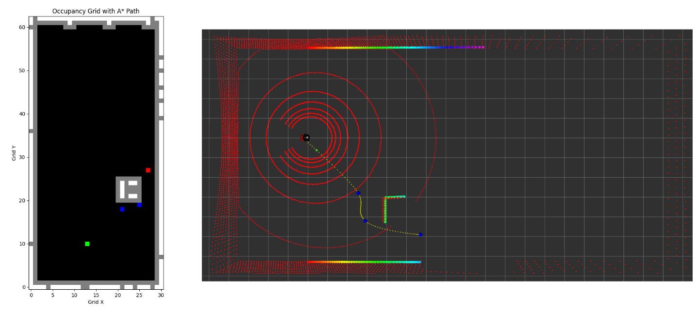

# Alfred UGV

This is the official implementation of [Alfred UGV (Report)](https://drive.google.com/file/d/1xcbomTqWQFI5U3ZL3wshn6ydCLDhJ_Dn/view?usp=sharing).


# Installation
```shell
$ git clone git@github.com:vishweshvhavle/alfred.git
$ cd alfred/
$ conda create -n alfred python=3.8
$ conda activate alfred
$ pip install -r requirements.txt
```

## 1. Install GPU Dependencies

We have only tested our GPU packages on Nvidia AGX Orin with Ubuntu 20.04. We use the NVIDIA Orin for simulation as well as for creating occupancy grids, path-planning, and waypoint navigation.

Main dependencies: 

* [ROS Noetic](http://wiki.ros.org/noetic/Installation)
* [PyTorch](https://pytorch.org/get-started/locally/)

The network can be run with a standard 2D laser, but this implementation uses a simulated [3D Velodyne sensor](https://github.com/lmark1/velodyne_simulator). This package was developed on top [DRL-Robot-Navigation](https://github.com/reiniscimurs/DRL-robot-navigation).

Compile the workspace:
```shell
$ cd ~/alfred/gpu-packages/catkin_ws
$ catkin_make_isolated
```

Open a terminal and set up sources:
```shell
$ export ROS_HOSTNAME=localhost
$ export ROS_MASTER_URI=http://localhost:11311
$ export ROS_PORT_SIM=11311
$ export GAZEBO_RESOURCE_PATH=~/alfred/gpu-packages/catkin_ws/src/multi_robot_scenario/launch
$ source ~/.bashrc
$ cd ~/alfred/gpu-packages/catkin_ws
$ source devel_isolated/setup.bash
```

## 2. Install CPU Dependencies

We have only tested our CPU packages on Intel NUC 12 Pro with Ubuntu 20.04. The SLAM node in this package was developed on top of [F-LOAM](https://github.com/wh200720041/floam).

Main dependencies: 

* [ROS Noetic](http://wiki.ros.org/noetic/Installation)
* [PyTorch](https://pytorch.org/get-started/locally/) (CPU Version)
* [Ceres Installation](http://ceres-solver.org/installation.html).
* [PCL Installation](http://www.pointclouds.org/downloads/linux.html).

# How to Run

## For GPU Packages



Open a terminal and set up sources using the shortcut shell script (Ensure appropriate permissions are granted to the shell script):
```shell
$ cd alfred/gpu-packages/sim/
$ sh ./exportros.sh
$ cd alfred/gpu-packages/waypoint/
$ python3 waypoints.py
$ python3 path_planning_node.py
```

## For CPU Packages


Open a terminal and set up sources with the ros master at GPU node:
```shell
$ export ROS_HOSTNAME=gpu-node-ip
$ export ROS_MASTER_URI=http://gpu-node-ip:11311
```

To switch on the bot operations:
```shell
$ cd alfred/cpu-packages/controller/
$ python3 controller.py
```

For object detection inferences:
```shell
$ cd alfred/cpu-packages/detection/
$ python3 detection.py
```

For F-LOAM based localization and mapping:
```shell
$ cd alfred/cpu-packages/floam
$ catkin_make
$ source devel/setup.bash
```
Launch ROS
```
roslaunch floam floam.launch
```
If you would like to create the map at the same time, you can run (more cpu cost)
```
roslaunch floam floam_mapping.launch
```
You may wish to test FLOAM on your own platform and sensor such as VLP-16
You can install the velodyne sensor driver by 
```
sudo apt-get install ros-noetic-velodyne-pointcloud
```
Launch floam for your own velodyne sensor
```
roslaunch floam floam_velodyne.launch
```

# Resources
## Links to 3D Printable Files, PCB Gerbers and Designs for Laser Cutting
[Google Drive Link](https://drive.google.com/drive/folders/1f_hGOYu5EU9SzpqOJjtLgKvULTiSWQi8?usp=sharing)

## Links to Parts
[Google Sheets Link](https://docs.google.com/spreadsheets/d/1cG-RGQtmP1Nn3f39VJRI02Kv2sMw9BhIGyV3ISFxt6U/edit?usp=sharing)

# Issues
Please open Github issues for any installation/usage problems you run into.

# Citation

If you find this code useful for your research, please consider citing:

```
@inproceedings{alfred2024,
    author = {Vishwesh Vhavle and Jatin Kumar Sharma},
    title = {Alfred UGV},
    year = {2024},
}
@misc{alfred_2024,
  author       = {Vishwesh Vhavle and Jatin Kumar Sharma},
  title        = {Alfred UGV},
  year         = {2024},
  url          = {https://github.com/vishweshvhavle/alfred},
  note         = {Version 1.0.0}
}

```
